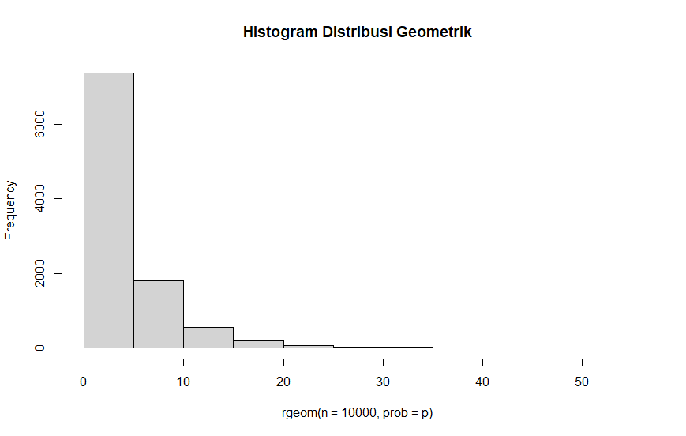

# Seorang penyurvei secara acak memilih orang-orang di jalan sampai dia bertemu dengan seseorang yang menghadiri acara vaksinasi sebelumnya.

## A. Berapa peluang penyurvei bertemu x = 3 orang yang tidak menghadiri acara vaksinasi sebelum keberhasilan pertama ketika p = 0,20 dari populasi menghadiri acara vaksinasi ? (distribusi Geometrik)

function distribusi geometric
```r
p = 0.20
x = 3
dgeom(x = x, prob = p)
```
hasilnya adalah 0.1024

## B. mean Distribusi Geometrik dengan 10000 data random , prob = 0,20 dimana distribusi geometrik acak tersebut X = 3 ( distribusi geometrik acak () == 3 )
```r
mean(rgeom(n = 10000, prob = p) == 3)
```
hasilnya adalah 0.1049

## C. Bandingkan Hasil poin a dan b , apa kesimpulan yang bisa didapatkan?
dalam case ini hasil poin b lebih besar dari poin a karena merupakan hasil perhitungan dari 1000 data dan diacak

## D. Histogram Distribusi Geometrik , Peluang X = 3 gagal Sebelum Sukses Pertama
```r
hist(rgeom(n = 10000, prob = p), main ="Histogram Distribusi Geometrik")
```


## E. Nilai Rataan (μ) dan Varian (σ²) dari Distribusi Geometrik.
- mean didapat dari banyak data * peluang
- varian didapat dari mean * komplemen peluang 
