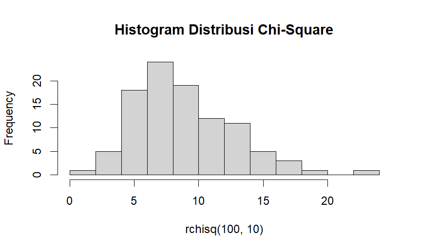

# Diketahui nilai x = 2 dan v = 10. Tentukan:

## A. Fungsi Probabilitas dari Distribusi Chi-Square.
function Distribusi Chi-Square
```r
dchisq(2, 10)
```
dengan hasil 0.007664155


## B. Histogram dari Distribusi Chi-Square dengan 100 data random.
Histogram
```r
hist(rchisq(100, 10), main = "Histogram Distribusi Chi-Square")
```


## C. Nilai Rataan (μ) dan Varian (σ²) dari DistribusiChi-Square
- mean didapat dari v = 10
- varian didapat dari mean * 10